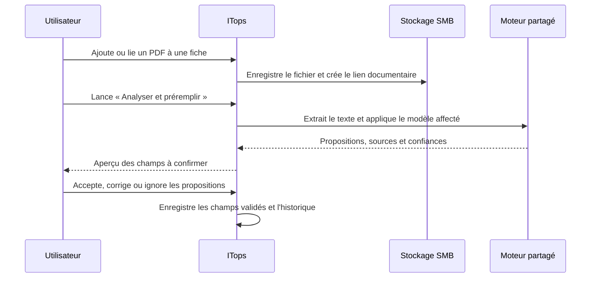

# Cahier des charges — Moteur partagé de préremplissage documentaire V1

## 1. Objet

ITops doit pouvoir analyser un document joint à une fiche d’un module personnalisé afin de proposer le préremplissage des champs présents dans ce document. Le besoin initial concerne les devis et les bons de commande, puis doit pouvoir s’appliquer à tout module personnalisé qui possède au moins une catégorie documentaire configurée.

Le moteur est une capacité transversale. Un module ne contient aucune logique d’analyse propre : il reçoit uniquement l’affectation d’un ou plusieurs modèles de préremplissage.

La V1 est un assistant de saisie : aucune valeur extraite ne modifie une fiche sans validation explicite de l’utilisateur.

## 2. Résultats attendus

- Après le dépôt ou le lien d’un PDF, l’utilisateur peut lancer **Analyser et préremplir**.
- ITops extrait les informations disponibles et présente une proposition par champ.
- L’utilisateur accepte, modifie ou ignore chaque proposition avant l’enregistrement de la fiche.
- Les règles d’un modèle sont adaptables à plusieurs formats de documents d’un même fournisseur ou métier.
- Les modèles sont administrables, traçables, exportables et réutilisables entre modules.
- Le document reste la pièce de référence ; la proposition affiche la valeur source et, lorsque disponible, la page concernée.

## 3. Périmètre V1

La V1 couvre :

- PDF numériques et PDF numérisés ;
- catégories documentaires d’un module personnalisé ;
- extraction locale de texte et OCR lorsque le PDF ne contient pas de texte exploitable ;
- extraction par règles configurables ;
- dates, montants, devises, références, fournisseur, quantités et texte court ;
- aperçu, validation humaine et historique ;
- import et export JSON des modèles.

La V1 ne couvre pas :

- validation automatique sans intervention humaine ;
- apprentissage automatique à partir des corrections ;
- extraction fiable de lignes d’articles complexes ;
- analyse de documents protégés par mot de passe, manuscrits ou images de très mauvaise qualité ;
- appel à un service d’IA externe.

## 4. Principes de conception

### 4.1 Moteur partagé

Le moteur, les API, les contrôles de droits, l’historique, la persistance, l’import/export et les composants d’interface sont communs. Les modules personnalisés restent des consommateurs de configuration.

### 4.2 Préremplissage contrôlé

Une proposition n’est jamais une donnée validée. Une valeur est appliquée uniquement après confirmation de l’utilisateur. Les champs déjà renseignés ne sont jamais écrasés sans une action explicite.

### 4.3 Traçabilité

Chaque analyse conserve :

- le document lié ;
- le modèle et sa version ;
- la date, l’utilisateur et le moteur utilisé ;
- les valeurs proposées, leurs niveaux de confiance et leur source ;
- les choix effectués par l’utilisateur ;
- les valeurs finalement enregistrées.

### 4.4 Résilience aux formats variés

La V1 ne dépend pas de coordonnées fixes dans une page. Les modèles utilisent des ancres textuelles, des synonymes, des expressions régulières, des règles de normalisation et des contrôles de cohérence. Le moteur doit dégrader proprement son résultat : une valeur introuvable reste vide et une valeur ambiguë est signalée.

## 5. Modèles de préremplissage

Un modèle représente une stratégie d’extraction adaptée à un type de document.

### 5.1 Propriétés d’un modèle

| Propriété | Description |
| --- | --- |
| Nom | Libellé lisible, par exemple `Devis fournisseurs informatiques`. |
| Code | Identifiant stable unique. |
| État | Actif ou inactif. |
| Description | Usage attendu, fournisseurs visés et limites connues. |
| Types de document | Devis, bon de commande, facture, autre. |
| Langues | Français par défaut, extensible. |
| Seuil de proposition | Confiance minimale pour proposer une valeur. |
| Seuil de contrôle | Confiance sous laquelle la valeur est signalée à vérifier. |
| Version | Incrémentée à chaque modification publiée. |

### 5.2 Règles d’extraction

Chaque modèle contient une liste ordonnée de règles.

| Propriété | Description |
| --- | --- |
| Libellé | Nom fonctionnel de la règle. |
| Champ cible | Champ de la fiche à préremplir. |
| Type de valeur | Texte, date, montant, entier, liste, référence. |
| Méthode | Libellé/valeur, expression régulière, recherche d’ancre, table simple, valeur fixe ou calcul. |
| Ancres | Mots ou synonymes attendus : `N° devis`, `Référence`, `Date du devis`, `Total HT`. |
| Expression | Expression régulière facultative, appliquée au texte localisé. |
| Priorité | Ordre d’évaluation lorsqu’il existe plusieurs règles pour un champ. |
| Normalisation | Date ISO, séparateurs français, devise, espaces, suppression de libellés. |
| Validation | Format attendu, plage de valeur, liste autorisée ou contrôle de cohérence. |
| Politique d’écrasement | Proposer seulement si vide, toujours proposer, ne jamais proposer. |

### 5.3 Exemple : devis

| Champ ITops | Ancres possibles | Normalisation |
| --- | --- | --- |
| `fournisseur_hors_marche` | `Fournisseur`, `Vendeur`, en-tête émetteur | Rapprochement avec les fournisseurs existants. |
| `reference_devis` | `Devis n°`, `N° devis`, `Référence devis` | Conservation des lettres, chiffres et tirets. |
| `date_reception_devis` | `Date`, `Émis le`, `Date du devis` | Conversion vers `AAAA-MM-JJ`. |
| `montant_ht` | `Total HT`, `Montant HT` | Montant décimal français vers valeur numérique. |
| `montant_ttc` | `Total TTC`, `Net à payer` | Valeur de contrôle, si un champ est configuré. |

## 6. Administration des modèles

### 6.1 Inventaire

Le menu **Administration → Préremplissage documentaire** présente les modèles dans le treeview partagé.

Colonnes initiales :

- Nom ;
- Code ;
- État ;
- Types de document ;
- Nombre de règles ;
- Modules affectés ;
- Version ;
- Dernière modification ;
- Actions.

Le treeview fournit recherche, tri, sélection multiple, pagination, visibilité et ordre personnalisable des colonnes, conformément au moteur commun déjà utilisé dans ITops.

Actions de ligne :

- consulter ;
- modifier ;
- dupliquer ;
- activer ou désactiver ;
- exporter ;
- supprimer après confirmation.

Actions globales :

- créer un modèle ;
- importer un modèle JSON ;
- exporter la sélection ;
- analyser un document de test ;
- réinitialiser les filtres.

### 6.2 Éditeur de modèle

L’éditeur comprend :

1. identité et périmètre du modèle ;
2. règles d’extraction et validations ;
3. document de test et aperçu des résultats ;
4. historique des versions et publication.

L’enregistrement vérifie que chaque champ cible existe dans les modules concernés et que son type est compatible avec la règle.

### 6.3 Suppression

Un modèle affecté ne peut pas être supprimé sans action explicite. La modale doit proposer :

- annuler ;
- désactiver le modèle ;
- retirer les affectations puis supprimer.

Les analyses passées restent consultables avec une copie immuable de la version utilisée.

## 7. Affectation aux modules personnalisés

### 7.1 Éligibilité

Un module est éligible lorsqu’il possède au moins une catégorie documentaire active, avec une cible de stockage valide.

Le module affiche, dans son éditeur, une section **Préremplissage documentaire** listant ses catégories documentaires et les modèles affectés.

### 7.2 Configuration d’une affectation

Une affectation contient :

| Propriété | Description |
| --- | --- |
| Catégorie documentaire | Par exemple `Devis` ou `Bon de commande`. |
| Modèle | Modèle actif à employer. |
| Priorité | Ordre des modèles en cas de plusieurs modèles compatibles. |
| Déclenchement | Manuel en V1 ; proposition automatique après dépôt en option future. |
| Champs autorisés | Sous-ensemble facultatif des champs du modèle. |
| Politique d’écrasement | Valeurs vides seulement par défaut. |

Avant l’enregistrement, ITops vérifie que la cible de stockage existe et est accessible. Une cible supprimée ou recréée ne peut plus rester référencée silencieusement.

## 8. Parcours utilisateur

L’aperçu doit afficher, pour chaque champ : valeur actuelle, valeur proposée, niveau de confiance, extrait source, page et choix utilisateur. Un bouton permet d’accepter toutes les propositions admissibles, sans contourner les valeurs déjà renseignées.

## 9. Traitement documentaire V1

### 9.1 Chaîne locale

1. Vérifier le type et la taille du fichier.
2. Extraire le texte natif du PDF.
3. Lancer un OCR local uniquement si nécessaire.
4. Conserver le texte structuré, les pages et les positions disponibles.
5. Identifier le modèle ou laisser l’utilisateur choisir parmi les modèles affectés.
6. Appliquer les règles dans l’ordre de priorité.
7. Normaliser, valider et calculer une confiance par proposition.
8. Présenter l’aperçu de validation.

### 9.2 Confiance et cohérence

Le moteur attribue une confiance à chaque valeur en combinant : présence de l’ancre, qualité OCR, validité du format, unicité de la valeur et cohérence avec les autres champs.

Exemples de contrôles :

- `TTC >= HT` ;
- `TTC - HT` cohérent avec le taux de TVA détecté ;
- une date de devis n’est pas future de manière incohérente ;
- une référence ne contient pas uniquement un montant ;
- un fournisseur est rapproché avec une fiche fournisseur existante sans créer de doublon automatique.

## 10. Données et API

### 10.1 Entités persistées

- `document_prefill_templates` : définition, état, version, auteur et dates ;
- `document_prefill_template_rules` : règles ordonnées ;
- `document_prefill_assignments` : affectations module/catégorie/modèle ;
- `document_prefill_analyses` : document, modèle versionné, résultat brut, statut ;
- `document_prefill_proposals` : propositions par champ et décisions utilisateur.

### 10.2 API partagée

- CRUD des modèles ;
- import/export JSON ;
- liste des modules et catégories éligibles ;
- création et consultation d’une analyse ;
- application contrôlée des propositions ;
- consultation de l’historique d’une fiche.

Les API appliquent les droits de lecture du module, les droits de mise à jour de la fiche et les droits d’administration pour modifier les modèles.

## 11. Sécurité et confidentialité

- Les PDF restent sur le stockage ITops configuré.
- L’analyse V1 s’exécute localement sur le serveur ITops.
- Les journaux ne stockent pas le contenu intégral du PDF ; ils conservent seulement les extraits nécessaires à l’audit.
- Les mots de passe, secrets et champs explicitement sensibles sont exclus des propositions.
- Les droits documentaires existants s’appliquent à la lecture et à l’analyse.

## 12. Qualité, tests et critères d’acceptation

### 12.1 Corpus de test

Constituer un corpus anonymisé comprenant au minimum :

- 20 devis de fournisseurs différents ;
- 10 bons de commande ;
- PDF numériques et scans ;
- documents multipages ;
- variantes de libellés, formats de date et montants français ;
- cas incomplets, ambigus et illisibles.

### 12.2 Critères V1

- Aucun champ n’est modifié sans confirmation.
- Un modèle ne peut pas cibler un champ absent ou incompatible.
- Une cible de stockage invalide bloque l’affectation avec un message clair.
- Après ajout, liaison ou suppression d’un document, le treeview de la fiche est actualisé immédiatement.
- La suppression d’un document propose toujours de délier seulement ou de supprimer aussi le fichier hébergé.
- Les résultats d’analyse restent explicables : valeur, règle, page, extrait et confiance.
- Les modèles exportés puis importés conservent leurs règles et leurs versions.
- Les tests couvrent le moteur partagé, les API, la persistance, les permissions, les erreurs OCR et le cycle UI.

### 12.3 Mesure de qualité

La V1 est acceptée sur le corpus lorsque les champs simples — référence, date, montant HT/TTC et fournisseur — sont proposés correctement ou signalés comme incertains. Le taux de précision doit être mesuré par type de champ ; aucun objectif global de 99 % ne doit masquer un mauvais comportement sur les montants ou les références.

## 13. Évolutions IA locales

L’IA locale est une évolution pertinente, mais elle doit compléter le moteur de règles plutôt que le remplacer.

Une V2 pourra ajouter :

- classification du type de document ;
- extraction sémantique de documents aux mises en page variables ;
- rapprochement fournisseur avancé ;
- apprentissage assisté à partir des corrections validées ;
- modèle vision-langage local spécialisé document ;
- sélection automatique du meilleur modèle de préremplissage.

L’architecture V1 doit donc isoler le fournisseur d’analyse derrière un contrat commun : entrée document, texte et structure ; sortie propositions normalisées avec source et confiance. Le moteur de règles local reste le repli explicable et déterministe lorsque l’IA est indisponible ou incertaine.

## 14. Plan de réalisation

1. Schéma, persistance, droits et inventaire partagé des modèles.
2. Éditeur de règles, test sur document et import/export.
3. Affectation aux modules et validation des cibles de stockage.
4. Extraction locale et moteur de règles.
5. Aperçu de préremplissage, application contrôlée et historique.
6. Corpus de test, mesures de précision et documentation d’exploitation.
7. Extension IA locale V2 derrière le même contrat d’analyse.
